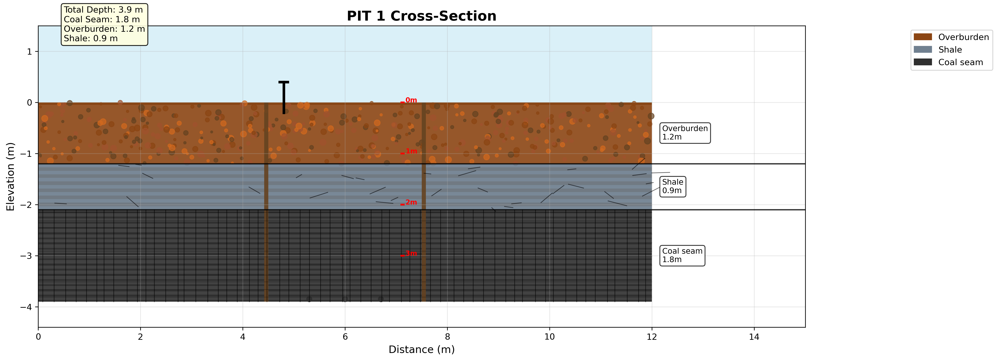
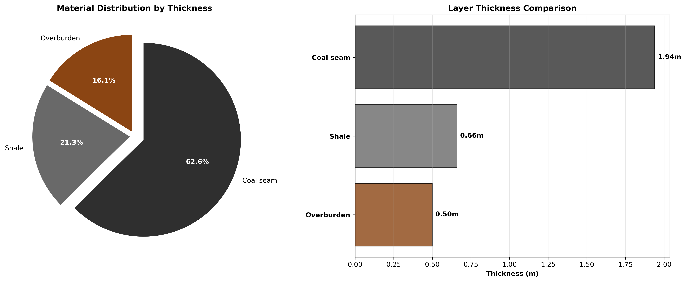

# 🏗️ Coal Pit Cross-Section Visualizations

This repository contains interactive **Jupyter notebooks** for generating **2D and 3D geological visualizations** of coal pit cross-sections.
Designed for **geological analysis, mining engineering, and education**, these notebooks let you explore pit layers interactively and export publication-quality figures.

---

## 📸 Example Outputs

| 2D Cross-Section                                              | 3D Visualization                                           | Charts                                                 |
| ------------------------------------------------------------- | ---------------------------------------------------------- | ------------------------------------------------------ |
|  |  |  |

---

## 📊 Notebook Overview

### 🔹 PIT 1 – 2D Cross-Section (`pit1_2d_cross_section.ipynb`)

* Geological profile (3.9 m depth: Overburden, Shale, Coal Seam).
* Step-by-step layer construction.
* Realistic textures and boundaries.
* Automatic PNG output at 300 DPI.

### 🔹 PIT 2 – 3D Multi-View (`pit2_3d_visualization.ipynb`)

* Geological profile (3.1 m depth: Overburden, Shale, Coal Seam).
* Interactive **rotatable 3D pit**.
* Multiple views: top, side, isometric.
* Extra charts: pie + bar geological summaries.

---

## ⚙️ Requirements

* Python 3.9+
* Jupyter Notebook or JupyterLab
* Libraries:

  ```txt
  matplotlib
  pandas
  numpy
  ```

Install via:

```bash
# Using pip
pip install jupyter matplotlib pandas numpy

# Or with conda
conda install jupyter matplotlib pandas numpy
```

---

## 🚀 Usage

1. Clone/download this repo.
2. Navigate to `pit_visualization/`.
3. Launch Jupyter:

   ```bash
   jupyter notebook
   ```
4. Open a notebook:

   * `pit1_2d_cross_section.ipynb` → 2D view
   * `pit2_3d_visualization.ipynb` → 3D view

👉 **Run cells with `Shift + Enter`**.

* 2D outputs saved to `pit_cross_section/`.
* 3D outputs saved to `3d_pit_visualizations/`.

---

## 🎨 Customization

* Edit `pit_data` DataFrame to change geological layers.
* Adjust colors in the color dictionary.
* Modify DPI/output settings in the last plotting cell.

Example:

```python
realistic_colors = {
    'Overburden': '#8B4513',
    'Shale': '#708090',
    'Coal seam': '#2F2F2F'
}
```

---

## 🐛 Troubleshooting

* **Plots not showing** → run cells in order.
* **3D not rotating** → use `%matplotlib notebook`.
* **Kernel issues** → restart via `Kernel > Restart`.

---

## 📘 Applications

* 🎓 **Education**: step-by-step geology visualization.
* 🏗️ **Professional**: rapid pit design prototyping.
* 📊 **Research**: presentation-ready figures.

---

## 🔄 Version Control Tips

Recommended `.gitignore`:

```txt
.ipynb_checkpoints/
__pycache__/
*.pyc
# Uncomment below if you don’t want outputs tracked
# pit_cross_section/
# 3d_pit_visualizations/
```

To keep notebooks clean before commit:

```bash
pip install nbstripout
nbstripout *.ipynb
```

---

✍️ Maintained by Leyard Kamanga
📜 License: MIT 

---